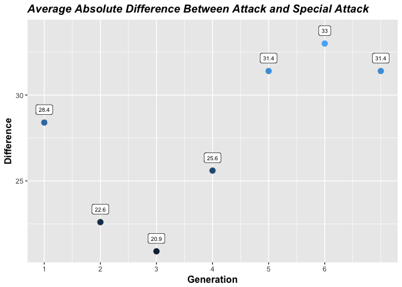

Pokémon Power Creep Analysis
================
Bailey Joseph
11/28/2017

 

 

Are Pokémon getting stronger over time?
---------------------------------------

Many games feature a power creep over time, and as a franchise that's been around for 21 years, Pokémon seems like a prime candidate. The motivation is simple -- keep pumping out stronger and stronger characters to keep people buying new games. Unlike many franchises, Pokémon doesn't actually *have* to do this, since each game is self contained and the company has been known to only allow pokemon from a single generation into their video game competitions. With that said, it seemed likely that the designers would feel pressure to outdo themselves each year when they sit down to come up with their newest batch.

The first measure to look at to try to answer our question is just the simple average stat total for Pokémon of each generation:

As you can see, the first three generations were relatively even. Compared to that baseline, stats started to rise in generations 4 and 5 before really taking off in generation 6.

Of course, it's possible to introduce power creep in other ways. For example, if the next generation were to introduce two pokemon, a low level bug with a horrendous BST (base stat total) of 100 and then have that pokemon evolve into a beast with 900 BST, that would surely reflect more of a power creep than an alternate generation who released two pokemon who each had a BST of 500, even though the average would be the same.

To adjust for this, let's take a look at the average BST of only the top fourth of each generation:

While the overall shape is very similar, we do now see some divergence within the first three generations. Outside of generation 5, which shows up as an exception to the trend in both graphs, the pattern also gets slightly stronger when looking at this measure. The difference between generation 6 and generation 1 is larger when we look only at the strongest pokémon

It's also possible that there's a more sneaky form of power creep going on. A pokémon usually only needs one of its attack stats to function. Even with the same base stat total, a pokémon with 150 attack and 15 special attack (Mega Beedrill) will be much stronger offensively than a pokémon with 85 in both stats (Murkrow) even though Murkrow has a slightly higher average attack stat. Let's see how much the spread between different attack stats changes over time:

This is an interesting pattern. The second and third generations actually had a smaller average difference in their attacking stats than generation 1, but that trend completely reversed starting in generation 4.

Of course, there's an extent to which this increase is very predictable. As average stats go up, it makes sense that the difference between attacking stats would go up as well. Think of drawing two points on a balloon and then blowing up the balloon. As the size of the balloon increases, the distance between the points will as well, even though there's no actual bias causing this to occur. To see if this phenomenon is the only reason for the general increase over time, let's reexamine the graph above after dividing the values on the y axis by the average BST of the pokémon in each generation.

The pattern is not as strong but does still persist. This implies a compound power creep -- As the average BST increases, so too does the difference between the two attacking stats.

It'll be interesting to see how this trend continues into future generations. Despite everything we've just seen, I don't think the power creep is nearly as bad as it could be considering how long the franchise has been creating new pokémon
